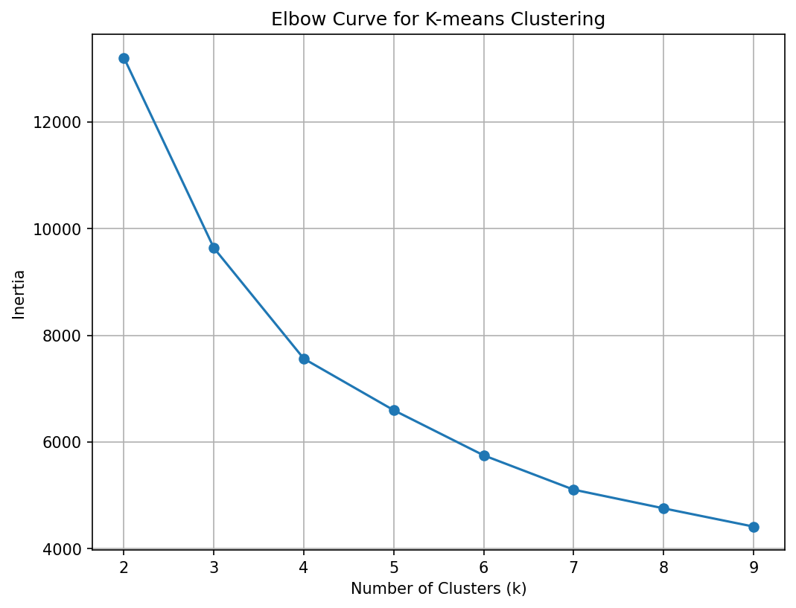
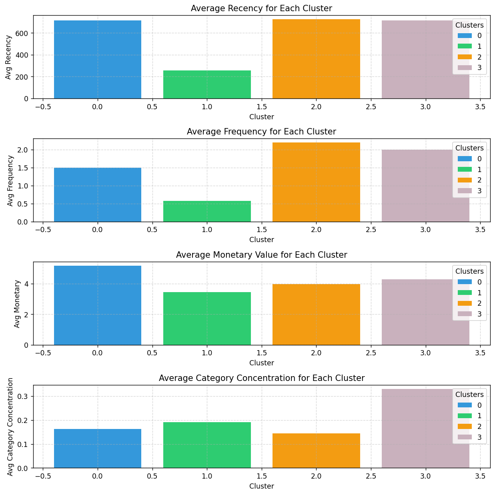

# Customer Segmentation — RFM & Category Behaviour

## Overview

K-means clustering model to segment ShopNow's customer base using RFM (Recency, Frequency, Monetary) metrics and category concentration, enabling targeted marketing actions.

## Results / Key Findings

- Identified four distinct customer segments: Recent High Spenders (VIPs), Loyal Customers, Inactive / At-Risk, and Category Specialists, each with clear differences in RFM and category focus.
- VIPs and Loyal Customers drive a disproportionate share of revenue, while Inactive / At-Risk customers represent the largest churn risk and the biggest opportunity for reactivation campaigns.
- Adding category behaviour (via Shannon Entropy) improves differentiation between generalists and specialists, making it easier to design personalized cross-sell and category-specific offers.

## Visual Preview

Best model selection and cluster structure are explored in the notebook, including the elbow method and segment profile plots.

## Models

- **Baseline:** K-means on RFM features (k=4)
- **Enhanced:** K-means on RFM + category concentration (k=4)

## Key Techniques

- Winsorization for outlier handling
- Log transformation + scaling (StandardScaler) for feature prep
- Elbow method for cluster selection
- Shannon Entropy for category behaviour feature engineering

## Segment Profiles

| Segment                     | Behaviour                               |
|----------------------------|-----------------------------------------|
| Recent High Spenders (VIPs)| High spend, moderate frequency          |
| Loyal Customers            | High frequency, mid basket size         |
| Inactive / At-Risk        | Low frequency, long since last purchase |
| Category Specialists       | Focused category buyers, mid value      |

## Tools

Python, Pandas, Scikit-learn, Matplotlib, Seaborn, Google Colab

## Dataset

Synthetic retail dataset with RFM, demographic, and category-level purchase data.

## How to Run

- Open `Customer_Segmentation.ipynb` directly in Google Colab (via “Open in Colab” or by uploading the notebook).
- Alternatively, clone this repository and run the notebook locally using Jupyter or VS Code with a Python environment that includes the listed libraries.
- Place the input dataset in the `data/` folder (or update the path in the notebook) and run all cells from top to bottom.
